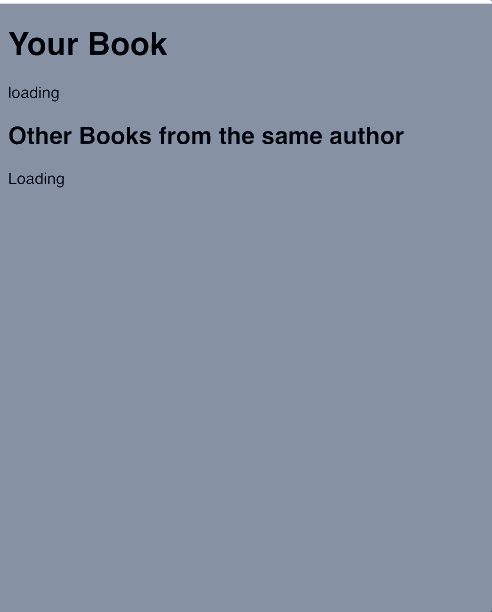

# React Hooks Workshop - Fetching Data

This is a workshop designed to practice the use of [React Hooks](https://reactjs.org/docs/hooks-intro.html).

It is based on students having already worked with React but using `Classes` instead. If learning React from scratch, I would recommend going through the materials listed [here](https://github.com/foundersandcoders/react-week) (React Week as part of the Founders and Coders bootcamp course).

## Background

I produced this workshop as part of mentoring at the Code Academy in Hebron (West Bank) to support the Code Academy, 15th Sept 2019 to 19th Sept 2019. The Code Academy is part of a technology entrepreneurship project established by [MercyCorp](https://www.mercycorps.org.uk/), a global humanitarian organisation.

The students had already learnt React but using `Classes`, so I spent most of a day with them teaching them React Hooks, as part of Refactoring Week.

The structure for the day is listed [on this hackmd note](https://hackmd.io/t6vlKsGeRISl2SbiUPoxbA?edit) - that I used as a presentation for the week.
  1. Introduction into React Hooks [Code Along](https://github.com/helenzhou6/react-hooks-introduction)
  2. Refactoring Classes into Hooks [Workshop](https://github.com/oliverjam/react-refactor-class-hooks) - thanks to @oliverjam
  3. This workshop

## Workshop Instructions

### The aim

The aim is to achieve this, after loading the page:

We will be using the [google books api](https://developers.google.com/books), and will be making two different api calls to: `https://www.googleapis.com/books/v1/volumes?q=isbn:${isbn}` and `https://www.googleapis.com/books/v1/volumes?q=inauthor:${author}`
- The title listed under 'Your Book' title will be the title received from `https://www.googleapis.com/books/v1/volumes?q=isbn:${isbn}`, where the `isbn` is `0747532699`.
  - I.e.: `https://www.googleapis.com/books/v1/volumes?q=isbn:0747532699` - [response](https://www.googleapis.com/books/v1/volumes?q=isbn:0747532699)
- Then based on this api call, you will use the author's name received to make another call to `https://www.googleapis.com/books/v1/volumes?q=inauthor:${author}` - and list the book titles received under the heading 'Other Books from the same author'.
  - I.e.: `https://www.googleapis.com/books/v1/volumes?q=inauthor:J.%20K.%20Rowling` -[response](https://www.googleapis.com/books/v1/volumes?q=inauthor:J.%20K.%20Rowling)

### Starting

Fork [this codesandbox](https://codesandbox.io/s/magical-austin-dpehz?file=/app.js:383-1275) - by pressing 'Fork' the blue button on the top right
  - Or use this repo:
    - `git clone https://github.com/helenzhou6/react-hooks-workshop.git`
    - `cd react-hooks-workshop`
    - `cd initial`
    - `npm i`
    - `npm start`
    - Follow the localhost link. It should hotreload automatically.

### The task

1. Use `fetchBookInfo()` to fetch book data on page load
2. Display the book title(s) or "Loading" when waiting for data
4. Then fetch other books from same author - using the author name of the first book `data.items[0].volumeInfo.authors[0]`
    - Use the `fetchAuthorBooks()` function
5. Display this error message "An Error happened! Please try again later" if api call fails
6. Refactor to use async / await and try / catch

### Useful Resources
- [Great talk introducing hooks](https://reactjs.org/docs/hooks-intro.html#video-introduction)
- [Official documentation](https://reactjs.org/docs/hooks-overview.html)
- [Founders and Coders React notes](https://github.com/oliverjam/learn-react/tree/master/03-a-date-with-state)

### Solution

Click if you're sure...

Find the solution either in this repo `./solution` folder, or [in this codesandbox](https://codesandbox.io/s/great-resonance-qyi64)

